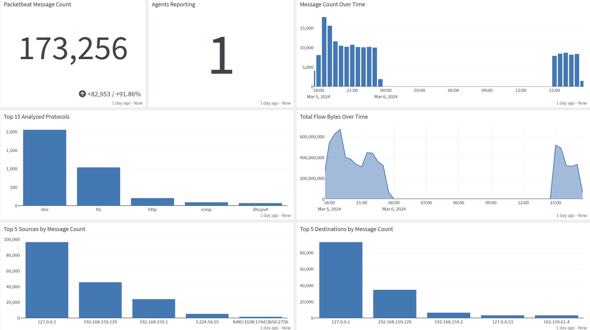
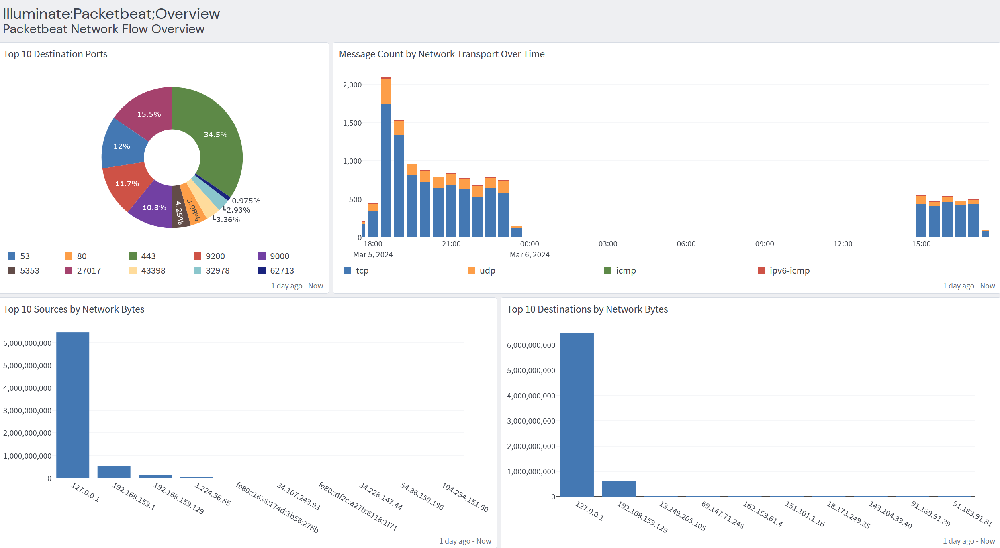
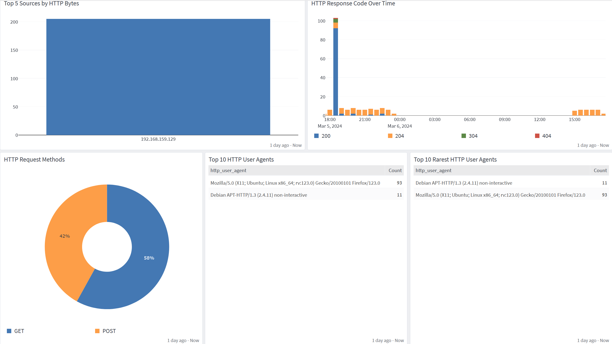

# Packetbeat

Graylog Illuminate is available for use with Graylog Operations and Graylog Security. Contact sales to learn more about obtaining the Graylog Illuminate release file.

Packetbeat is an open-source network packet analyzer that captures and analyzes network traffic in real-time. It provides insights into application performance, network latency, and security threats by monitoring communication between servers and applications. Packetbeat is designed to be lightweight and easy to deploy, making it a valuable tool for network monitoring and troubleshooting.

## Definition/Value Added

This technology pack will:

- Process Packetbeat logs, providing normalization and enrichment of those events.

### Supported Version(s)

- Packetbeat 8.12.2

### Requirements

- Packetbeat 8.12.2
- Graylog 5.2.4

### Stream Configuration

This technology pack includes one stream:

- "Illuminate:Packetbeat Messages"

**Hint**: If this stream does not exist prior to the activation of this pack, then it will be created and configured to route messages to this stream and the associated index set. There should not be any stream rules configured for this stream.

### Index Set Configuration

This technology pack includes one index set definition:

- "Packetbeat Logs"

**Hint**: If this index set is already defined, then nothing will be changed. If this index set does not exist, then it will be created with retention settings of a daily rotation and 90 days of retention. These settings can be adjusted as required after installation.

### Log Collection

- Sending logs via Beats Input

### Packetbeat Configuration Example

"To successfully ship logs to Graylog, ensure you add the IP address of your Graylog instance within your `packetbeat.yml` file. 

For example:
```
# ------------------------------ Logstash Output -------------------------------
output.logstash:
  # The Logstash hosts
  hosts: ["192.168.x.x:5044"]
```

### Log Format Example
```
{"timestamp":1707945509.782,"version":"1.1","host":"ip-172-31-71-138.ec2.internal","short_message":"-","_packetbeat_host_os_version":"2","_packetbeat_method":"QUERY","_packetbeat_related_ip":"[172.31.71.138, 172.31.0.2, 3.218.180.17]","_packetbeat_type":"dns","_packetbeat_cloud_instance_id":"i-01cd7cd147686ddca","_packetbeat_event_type":"[connection, protocol]","_packetbeat_query":"class IN, type A, dynamodb.us-east-1.amazonaws.com","_packetbeat_dns_question_etld_plus_one":"dynamodb.us-east-1.amazonaws.com","_packetbeat_dns_answers_count":1,"_packetbeat_host_containerized":"false","_packetbeat_dns_flags_authentic_data":"false","_packetbeat_destination_ip":"172.31.0.2","_packetbeat_dns_flags_truncated_response":"false","_packetbeat_host_os_kernel":"5.10.209-198.812.amzn2.x86_64","_packetbeat_event_end":"2024-02-14T21:18:29.784Z","_packetbeat_@metadata_beat":"packetbeat","_packetbeat_agent_name":"ip-172-31-71-138.ec2.internal","_packetbeat_dns_flags_authoritative":"false","_packetbeat_status":"OK","_packetbeat_agent_version":"8.12.1","_packetbeat_dns_answers_0_name":"dynamodb.us-east-1.amazonaws.com","_packetbeat_dns_flags_recursion_desired":"true","_packetbeat_network_type":"ipv4","_packetbeat_dns_authorities_count":0,"_packetbeat_dn_header_flags":"[RD, RA]","_packetbeat_resource":"dynamodb.us-east-1.amazonaws.com","_packetbeat_server_ip":"172.31.0.2","_packetbeat_@timestamp":"2024-02-14T21:18:29.782Z","_packetbeat_agent_ephemeral_id":"1a6a4861-3672-4794-ad48-fa7f6ce9e17c","_packetbeat_cloud_provider":"aws","_packetbeat_event_start":"2024-02-14T21:18:29.782Z","_packetbeat_host_os_codename":"Karoo","_packetbeat_dns_answers_0_ttl":"4","_packetbeat_host_mac":"[06-FB-50-7E-81-B1]","_packetbeat_dns_question_type":"A","_packetbeat_server_port":53,"_packetbeat_destination_port":53,"_packetbeat_client_bytes":50,"_packetbeat_event_category":"[network]","_packetbeat_dns_id":2180,"_packetbeat_dns_question_registered_domain":"dynamodb.us-east-1.amazonaws.com","_packetbeat_dns_resolved_ip":"[3.218.180.17]","_packetbeat_destination_bytes":66,"_packetbeat_host_os_platform":"amzn","_packetbeat_network_community_id":"1:n2oEH592UySL71Gm21GwZS2Jiwo=","_packetbeat_network_bytes":116,"_packetbeat_dns_answers_0_data":"3.218.180.17","_packetbeat_source_ip":"172.31.71.138","_packetbeat_cloud_availability_zone":"us-east-1e","_packetbeat_dns_flags_recursion_available":"true","_packetbeat_host_os_type":"linux","_packetbeat_dns_question_name":"dynamodb.us-east-1.amazonaws.com","_packetbeatdns_question_top_level_domain":"us-east-1.amazonaws.com","_packetbeat_ecs_version":"8.0.0","_packetbeat_host_name":"ip-172-31-71-138.ec2.internal","_packetbeat_dns_additionals_count":0,"_packetbeat_dns_answers_0_type":"A","_packetbeat_network_direction":"egress","_packetbeat_cloud_machine_type":"t2.micro","_packetbeat_host_ip":"[172.31.71.138, fe80::4fb:50ff:fe7e:81b1]","_packetbeat_cloud_region":"us-east-1","_packetbeat_network_transport":"udp","_packetbeat_dns_response_code":"NOERROR","_packetbeat_client_ip":"172.31.71.138","_packetbeat_cloud_account_id":"335344888946","_packetbeat_agent_id":"0d245eab-3205-4f95-8b23-2878569f4dbd","_packetbeat_event_kind":"event","_packetbeat_dns_question_class":"IN","_packetbeat_dns_answers_0_class":"IN","_packetbeat_host_id":"0e7b0d07010a489ba9e1a74d38cc23de","_packetbeat_source_port":46704,"_packetbeat_client_port":46704,"_packetbeat_dns_type":"answer","_packetbeat_source_bytes":50,"_packetbeat_dns_op_code":"QUERY","_packetbeat_server_bytes":66,"_packetbeat_host_architecture":"x86_64","_packetbeat_network_protocol":"dns","_packetbeat_dns_flags_checking_disabled":"false","_packetbeat_host_os_name":"Amazon Linux","_packetbeat_@metadata_type":"_doc","_packetbeat_agent_type":"packetbeat","_packetbeat_cloud_service_name":"EC2","_packetbeat_event_dataset":"dns","_packetbeat_event_duration":1717000,"_packetbeat_host_os_family":"redhat","_packetbeat_@metadata_version":"8.12.1","_packetbeat_host_hostname":"ip-172-31-71-138.ec2.internal","_packetbeat_cloud_image_id":"ami-0aa7d40eeae50c9a9"}
```
## What is Provided

- We provide parsing rules to normalize and enrich Packetbeat log messages.
- We provide Categorization for the following log types:
    - DNS
    - HTTP
    - Flow

## Events Processed by This Technology Pack

The Packetbeat content pack supports parsing for all fields, and GIM categorization for DNS, Flow, and HTTP events.

## Packetbeat Spotlight Content Pack

Packetbeat offers a dashboard with 3 tabs - An overview tab, a network flow tab, and a tab for an overview of http

- Packetbeat Overview Tab


- Packetbeat Network Flows Tab


- HTTP Overview Tab



